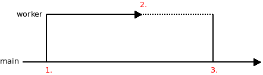
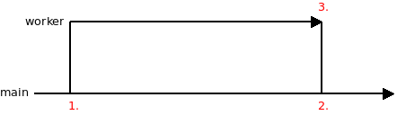
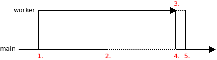
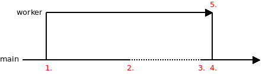
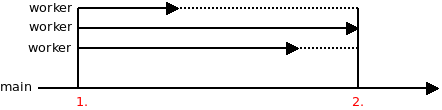

## What is concurrency?

Concurrency allows multiple functions to run independent of one another.

## How is concurrency implemented in libdill?

Functions that are meant to run concurrently must be annotated with the `coroutine` modifier.

```c
coroutine void foo(int arg1, const char *arg2);
```

To launch a coroutine, use the `go` keyword:

```c
go(foo(34, "ABC"));
```

Launching concurrent functions — or `coroutines`, in libdill terminology — using the `go` construct and switching between them is extremely fast. It requires only a few machine instructions. This makes coroutines a suitable basic flow control mechanism, not unlike the `if` or `while` keywords, which have comparable performance.

Coroutines have one big limitation, though: All  coroutines run on a single CPU core. If you want to take advantage of multiple cores, you have to launch multiple threads or processes, presumably as many of them as there are CPU cores on your machine.

Coroutines are scheduled cooperatively. What that means is that a coroutine has to explicitly yield control of the CPU to allow a different coroutine to run. In a typical scenario, this is done transparently to the user: When a coroutine invokes a function that would block (such as `msleep` or`chrecv`), the CPU is automatically yielded. However, if a coroutine runs without calling any blocking functions, it may hold the CPU forever. For these cases, the `yield` function can be used to manually relinquish the CPU to other coroutines manually.

## What is structured concurrency?

Structured concurrency means that lifetimes of concurrent functions are cleanly nested. If coroutine `foo` launches coroutine `bar`, then `bar` must finish before `foo` finishes.

This is not structured concurrency:


This is structured concurrency:


The goal of structured concurrency is to guarantee encapsulation. If the `main` function calls `foo`, which in turn launches `bar` in a concurrent fashion, `main` will be guaranteed that once `foo` has finished, there will be no leftover functions still running in the background.

What you end up with is a tree of coroutines rooted in the `main` function. This tree spreads out towards the smallest worker functions, and you may think of this as a generalization of the call stack — a call tree, if you will. In it, you can walk from any particular function towards the root until you reach the `main` function:


## How is structured concurrency implemented in libdill?

As with all idiomatic C, you have to do it by hand.

The good news is that it's easy.

The `go` construct returns a handle. The handle can be closed, and thereby kill the associated concurrent function.

```c
int h = go(foo());
do_work();
hclose(h);
```

What happens to a function that gets killed? It may have some resources allocated, and we want it to finish cleanly, without leaking those resources.

The mechanism is simple. In a function being killed by `hclose`, all blocking calls will start failing with the `ECANCELED` error. On one hand, this forces the function to finish quickly (there's not much you can do without blocking functions); on the other hand, it provides an opportunity for cleanup.

```c
coroutine void foo(void) {
    void *resource = malloc(1000);
    while(1) {
        int rc = msleep(now() + 100);
        if(rc == -1 && errno == ECANCELED) {
            free(resource);
            return;
        }
    }
}
```

## What about asynchronous objects?

Sometimes, instead of launching a coroutine, you may want to create an object that runs coroutines in the background.
For example, an object called `tcp_connection` may run two coroutines, one for asynchronously reading data from and one for asynchronously writing data to the network.

Still, it would be nice if the object was a node in the calltree, just like a coroutine is.

In other words, you may want a guarantee that once the object is deallocated there will be no leftover coroutines running:


And there's no trick there. Just do it in the most straightforward way. Launch the coroutines in the function that opens the object and close them in the function the closes the object. When the main function closes the connection object, both the sender and receiver coroutine will be stopped automatically.

```c
struct tcp_connection {
    int sender;
    int receiver;
}

void tcp_connection_open(struct tcp_connection *self) {
    self->sender = go(tcp_sender(self));
    self->receiver = go(tcp_receiver(self));
}

void tcp_connection_close(struct tcp_connection *self) {
    hclose(self->sender);
    hclose(self->receiver);
}
```

## What are the use cases?

WARNING: To keep examples in this section succint error handling was omitted.

#### Child finishes before parent



```c
coroutine void worker(void) {
    msleep(now() + 500);
    /* 2. */
}

int main(void) {
    int cr = go(worker()); /* 1. */
    msleep(now() + 1000);
    hclose(cr); /* 3. */
    return 0;
}
```

The worker coroutine finishes at the point 2. The stack of the coroutine is deallocated at that point. However, handle owned by the parent still points to a small "bundle" object. That object is deallocated later on at point 3.

#### Parent finished before child



```c
coroutine void worker(void) {
    int rc = msleep(now() + 1000);
    if(rc < 0 && errno == ECANCELED) return; /* 3. */
    assert(0);
}

int main(void) {
    int cr = go(worker()); /* 1. */
    msleep(now() + 500);
    hclose(cr); /* 2. */
    return 0;
}
```

When worker coroutine is closed at point 2. it is still running. From that point on, all the blocking calls in the coroutine start to return `ECANCELED` error (point 3.) The call to `hclose()` won't finish until the worker coroutine exits.

#### Parent waits for child


```c
coroutine void worker(int ch) {
    msleep(now() + 1000);
    int val = 42;
    chsend(ch, &val, sizeof(val), -1); /* 3. */
}

int main(void) {
    int ch[2];
    chmake(ch);
    int cr = go(worker(ch[1])); /* 1. */
    msleep(now() + 500);
    /* 2. */
    int val;
    chrecv(ch[0], &val, sizeof(val), -1);
    /* 4. */
    hclose(cr); /* 5. */
    return 0;
}
```

In this use case, child coroutine does a computation. At some point, parent coroutine needs the result of the computation. It waits till the child coroutine is finished (points 2-4.) and retrieves the result.

#### Parent gives child a grace period to finish



```c
coroutine void worker(int ch) {
    msleep(now() + 1000);
    int val = 42;
    chsend(ch, &val, sizeof(val), -1); /* 3. */
}

int main(void) {
    int ch[2];
    chmake(ch);
    int cr = go(worker(ch[1])); /* 1. */
    msleep(now() + 500);
    /* 2. */
    int val;
    chrecv(ch[0], &val, sizeof(val), now() + 1000);
    /* 4. */
    hclose(cr); /* 5. */
    return 0;
}
```

#### Parent gives child a grace period, but child fails to finish



```c
coroutine void worker(int ch) {
    int rc = msleep(now() + 2000);
    if(rc < 0 && errno == ECANCELED) return; /* 5. */
    int val = 42;
    chsend(ch, &val, sizeof(val), -1);
}

int main(void) {
    int ch[2];
    chmake(ch);
    int cr = go(worker(ch[1])); /* 1. */
    msleep(now() + 500);
    int val;
    /* 2. */
    chrecv(ch[0], &val, sizeof(val), now() + 1000);
    /* 3. */
    hclose(cr); /* 4. */
    return 0;
}
```

### Parent launches multiple children



```c
coroutine void worker(void) {
    int rc = msleep(now() + (random() % 1000));
    if(rc < 0 && errno == ECANCELED) {
        return; /* 4. */
    }
    /* 2. */
}

int main(void) {
    int b = bundle();
    int i;
    for(i = 0; i != 3; i++)
        bundle_go(b, worker()); /* 1. */
    msleep(now() + 500);
    hclose(b); /* 3. */
    return 0;
}
```
