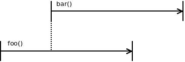
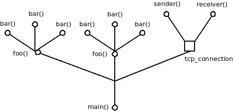

## What is concurrency?

Concurrency means that multiple functions can run independently of each another.

## How is concurrency implemented in libdill?

Functions that are meant to run concurrently must be annotated by `coroutine` modifier.

```c
coroutine void foo(int arg1, const char *arg2);
```

To launch the coroutine use `go` keyword:

```c
go(foo(34, "ABC"));
```

Launching a concurrent function -- a `coroutine` in libdill terminology -- using `go` construct  as well as switching between multiple running coroutines is extremely fast, it requires only few machine instructions. In other words, coroutines can be used as flow control mechanism, similar to `if` or `while`. The performance is comparable.

However, there's one huge limitation: All the coroutines run on a single CPU core. If you want to take advantage of multiple cores you have to launch multiple processes, presumably as many of them as there are CPU cores on your machine.

Coroutines are scheduled cooperatively. What that means is that one coroutine has to explicitly yield control of the CPU to allow a different coroutine to run. In the typical case this is done transparently to the user: When coroutine invokes a function that would block (like `msleep` or`chrecv`) the CPU is automatically yielded. However, if a coroutine does work without calling any blocking functions it may hold the CPU forever. For these cases there's a `yield` function to yield the CPU to other coroutines manually.

## What is structured concurrency?

Structured concurrency means that lifetimes of concurrent functions are cleanly nested one inside another. If coroutine `foo` launches coroutine `bar` then `bar` must finish before `foo` finishes.

This is not structured concurrency:



On the other hand, this is structured concurrency:


The goal of structured concurrency is to guarantee encapsulation. If main function calls `foo` which in turn launches `bar` in concurrent fashion, main is guaranteed that after `foo` finishes there are no leftover functions still running in the background.

What you end up with is a tree of coroutines rooted in the main function and spreading out toward the smallest worker functions. You also think of it as a generalisation of call stack, a call tree, if you will, in which you can walk from any particular function towards the root until you reach the main function:


## How is structured concurrency implemented in libdill?

As with everything that's idiomatic C you have to do it by hand.

The good news is that it's easy to do.

`go` construct returns a handle. The handle can be closed thus killing the concurrent function.

```c
int h = go(foo());
do_work();
hclose(h);
```

What about function being killed? It may have some resources allocated and we want it to finish cleanly, not leaving any memory or resource leak behind.

The mechanism is simple. In function being killed by `hclose` all the blocking calls start returning `ECANCELED` error. That on one hand forces the function to finish quickly (there's no much you can do without blocking functions anyway) but it also provides a way to clean up:

```c
coroutine void foo(void) {
    void *resource = malloc(1000);
    while(1) {
        int rc = msleep(now() + 100);
        if(rc == -1 && errno == ECANCELED) {
            free(resource);
            return;
        }
    }
}
```

## What about asynchronous objects?

Sometimes you don't want to launch a coroutine but rather to create an object that runs coroutines in the background. For example, an object called `tcp_connection` may run two coroutines, one for asynchronously reading data from the network, one for sending data to the network.

Still, it would be nice if the object was a node in the calltree, just like a coroutine is.

In other words, you want a guarantee that once the object is deallocated there are no leftover coroutines running:



And there's no trick there. Just do it in the most straightforward way. Launch the coroutines in function that opens the object and close them in the function the closes the object. Once main function closes the connection object, both sender and receiver coroutines will be automatically stopped.

```c
struct tcp_connection {
    int sender;
    int receiver;
}

void tcp_connection_open(struct tcp_connection *self) {
    self->sender = go(tcp_sender(self));
    self->receiver = go(tcp_receiver(self));
}

void tcp_connection_close(struct tcp_connection *self) {
    hclose(self->sender);
    hclose(self->receiver);
}
```

## Stack-on-stack

Given that with structured concurrency child coroutine always finishes before the parent coroutine it is possible to keep child's stack as a local variable on parent's stack. Doing it is dangerous (stack overflow in child can corrupt parent's stack) and not recommended unless there are heavy constraints on memory usage. Still, the technique is worth of mention:

```c
coroutine parent(void) {
    char stk[1024];
    int h = go_stack(child(), stk, sizeof(stk));
    ...
    hclose(h);
}
```

